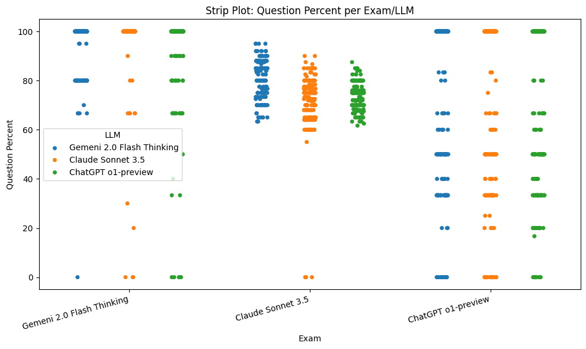

# LLM Comparison

## Project Overview
This repository demonstrates a framework for testing and comparing advanced reasoning capabilities of different Large Language Models (LLMs). Each LLM:
- Creates a test (list of prompts).
- Creates a rubric (objective scoring criteria).
- Applies its test to all LLMs (including itself).
- Grades each response with the rubric.

Multiple “runs” are conducted to gather data across several iterations.

---

## How It Works
1. **Grader Class**  
   There is a `GraderLLM` class that handles:
   - Building tests and rubrics by instructing an LLM to generate prompts and scoring criteria.
   - Applying tests to target LLMs.
   - Grading responses according to the generated rubric.

2. **LLM Instances**  
   Multiple LLMs (e.g., Claude, ChatGPT, Gemini) are instantiated using the `GraderLLM` wrapper. Each model will:
   - Generate its own test and rubric.
   - Answer the tests from all other models.
   - Score all answers using its rubric.

3. **Data Storage**  
   All tests, rubrics, responses, and scores are saved into a specified directory (e.g., `data/run1`). Each run is kept separate.

4. **Analysis**  
   The results are compiled into pandas DataFrames and visualized using:
   - Bar plots
   - Line plots
   - Box plots
   - Strip plots
   - Heatmaps

    
   These visualizations allow you to see each LLM’s performance across multiple exams and runs.

---

## Installation & Setup
1. **Clone the Repository**
 
git clone \<this-repo-url> 
 
cd \<this-repo-directory>

2. **Install Dependencies**  
Make sure you have Python 3.7+ installed. Then install the required packages:
pip install -r requirements.txt

3. **Set Environment Variables**  
Add your API keys to the  `.env` file.

---

## Instructions to Replicate
1. **Load Environment**  
Load your API keys by ensuring the `.env` file is properly set or by exporting variables in your shell.

2. **Run the Main Notebook**  
The notebook imports the `GraderLLM` class and then creates a list of LLMs. It builds tests, applies them, saves data, compiles scores, and generates visualizations. Adjust any model parameters (e.g., temperature, model name) as desired.

3. **Check Output**  
In the `data/runX` folders, you will find:
- Generated tests (`test.txt`)
- Generated rubrics (`rubric.txt`)
- Model responses (`response.txt`)
- Scores (`score.txt`)

4. **View Visualizations**  
Plots of results will appear in your Python environment. You can also save or customize these plots as needed.

---

## Analysis of Results
- **Comparative Performance**: Each model is tested by multiple rubrics. Scores reflect how well it responded to each type of prompt.  GPT o1 and Claude Sonnet 3.5 tended to perform the best altogether.
- **Consistency Across Runs**: Performing multiple runs reveals patterns and consistency of each model’s capabilities.  GPT o1 tends to give the lowest scores, and Gemini tends to give the highest.
- **Question-by-Question Trends**: By looking at per-question results, you can see which categories or prompt types tend to challenge each model.  GPT o1 gives the most consistent grades for its exams across runs.
- **Inter-Model Correlations**: The heatmap can show correlations in performance, providing insight into whether models do similarly well or poorly on specific question sets.

Take a look at the results for many more insights!

---

## Contact / Further Assistance
Please feel free to open an issue or contact me if you need help with:
- **API Key Configuration**
- **Expanding Tests/Rubrics**
- **Additional Visualizations**
- **Integrating New LLMs**

Enjoy experimenting with advanced reasoning LLMs and exploring how each model fares under different assessment scenarios!
